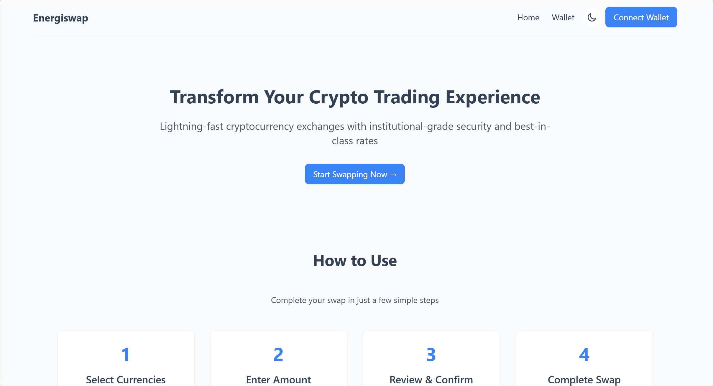
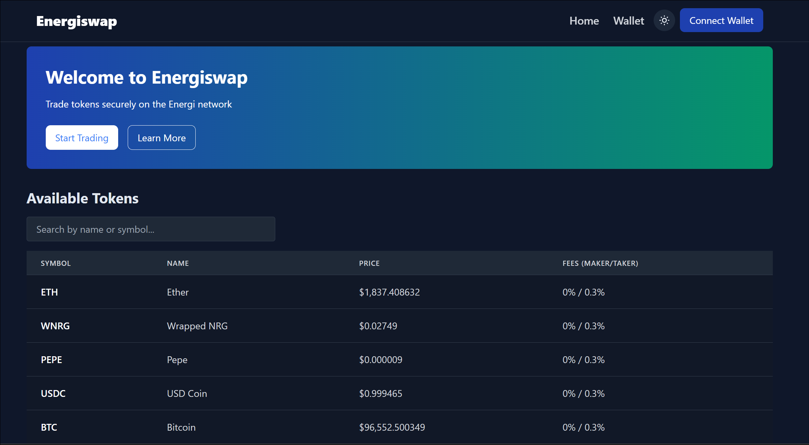
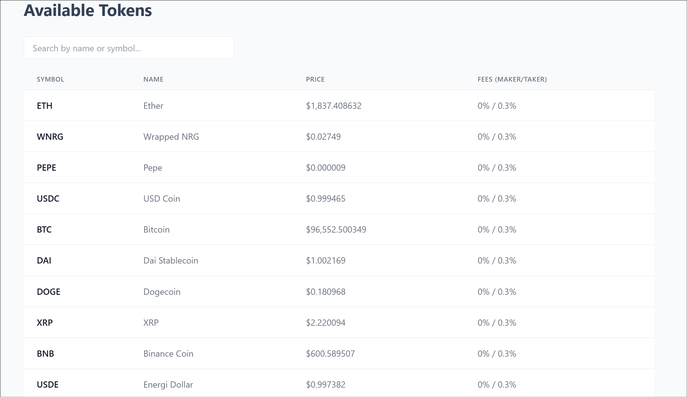
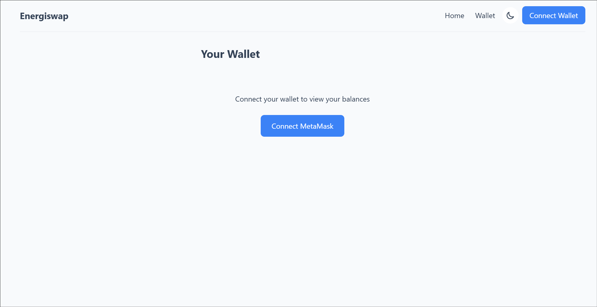
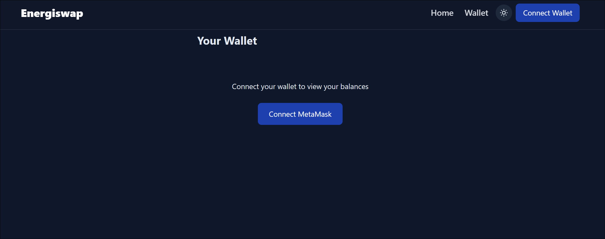
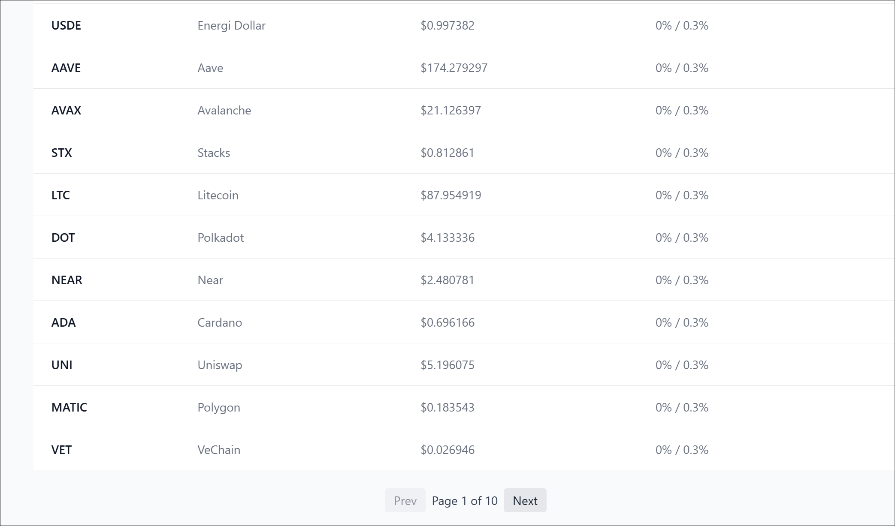
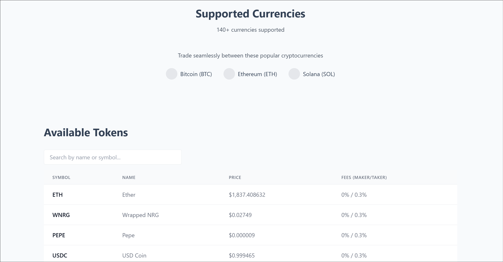

# EnergiSwap dApp - Decentralized Cryptocurrency Exchange



A modern decentralized application (dApp) for swapping cryptocurrencies with real-time market data and secure wallet integration.

## 🔗 Live Demo
**[https://d-wallet2.vercel.app/home](https://d-wallet2.vercel.app/home)**

## 👨‍💻 Developer
**[Kundan Kumar](https://github.com/its-kundan)**

## ✨ Features

- Real-time cryptocurrency price data
- MetaMask wallet integration
- Dark/light mode toggle
- Responsive design for all devices
- Sortable token table with market data
- Secure transaction handling

## 🖼️ Screenshots

### Light Mode Dashboard
  
*Clean, modern interface with real-time market data in light theme.*

### Dark Mode Dashboard
  
*Eye-friendly dark theme for comfortable nighttime trading.*

### Mobile Responsive View
  
*Fully responsive design that works perfectly on any device size.*

### Token Market Data
  
*Comprehensive token table with sortable columns and price information.*

### Wallet Integration
  
*Seamless MetaMask wallet connection with one-click onboarding.*

### Wallet Overview
  
*Detailed wallet dashboard showing balances and transaction history.*

### Pagination System
  
*User-friendly pagination for browsing through extensive token lists.*

### Support Section
  
*Helpful support section with FAQs and contact options.*

## 🚀 Technologies Used

- **Frontend**: Next.js, React, Tailwind CSS
- **Web3**: Ethers.js, MetaMask API
- **State Management**: React Context API
- **API**: EnergiSwap Exchange API
- **Build Tools**: Vercel, Yarn

## 🛠️ Installation

1. Clone the repository:
   ```bash
   git clone https://github.com/its-kundan/energi-frontend.git
   ```
2. Install dependencies:
   ```bash
   cd energi-frontend
   yarn install
   ```
3. Start the development server:
   ```bash
   yarn dev
   ```
4. Open [http://localhost:3000](http://localhost:3000) in your browser

## 🌟 Why This Project?

This dApp demonstrates:
- Modern Web3 development practices
- Clean UI/UX design principles
- Secure wallet integration
- Real-time data handling
- Responsive design implementation

## 🤝 Contributing

Contributions are welcome! Please open an issue or submit a pull request.
